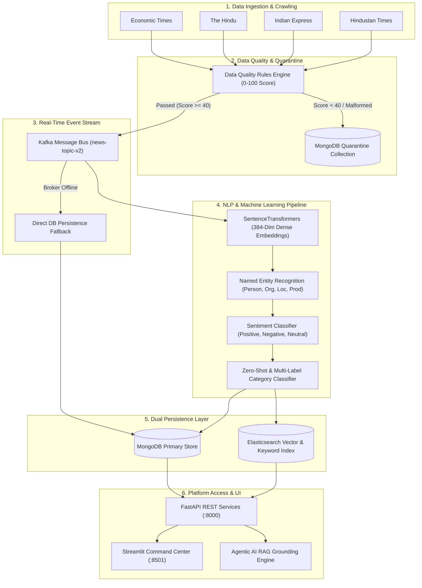

# 📰 Real-Time News Intelligence Platform


A company-grade, end-to-end platform for collecting, processing, enriching, indexing, and analyzing news data from major media outlets in near real-time. Featuring a multi-stage NLP pipeline, dense vector & hybrid search, temporal analytics engine, Agentic AI RAG grounding, and an interactive Streamlit Command Center.

---

## 🏗️ Architecture & Data Flow



---

## ✨ Core Capabilities

### 1. Multi-Source Crawler & Data Quality Gate
* **Automated News Scrapers**: Continuous background crawling across major media sources (*Economic Times*, *The Hindu*, *Indian Express*, *Hindustan Times*).
* **Defensive Quality Scoring**: 0–100 quality scoring evaluating title cleanliness, valid HTTP links, publication timestamps, and minimum body length.
* **Automated Quarantine**: Malformed or incomplete items are safely diverted to `quarantine_articles` without breaking ingestion streams.

### 2. Advanced Multi-Task NLP Enrichment Engine
* **384-Dimensional Dense Vector Embeddings**: SentenceTransformers (`all-MiniLM-L6-v2`) generating semantic vector representations for cosine similarity & RAG grounding.
* **Named Entity Intelligence (NER)**: Identifies and links People, Organizations, Locations, and Commercial Products across stories.
* **Category & Sentiment Analysis**: Classifies articles into 12 primary domains (*Politics, Business, Technology, Sports, World, Crime, India, Science, Health, Finance, Education*) alongside confidence-scored sentiment polarity.

### 3. High-Availability Dual Storage Architecture
* **Primary Database**: MongoDB powering document persistence, ingestion state checkpoints, and fallback vector/keyword search.
* **Hybrid Search Engine**: Elasticsearch 8+ providing combined dense vector and BM25 keyword search, with automatic MongoDB failover when ES is unattached.
* **Real-Time Streaming**: Apache Kafka messaging with manual offset commits and auto-recovery.

### 4. FastAPI REST Services (`http://localhost:8000`)
Extensive OpenAPI-compliant endpoint suite providing:
* `/api/news`: Filtered news query with category, sentiment, and date parameters.
* `/api/entity-intelligence`: Cross-publisher entity co-occurrence graphs.
* `/api/coverage-comparison`: 4-Newspaper side-by-side volume & sentiment breakdown.
* `/api/rag/query`: Agentic RAG Q&A with grounded article citations.
* `/api/system/telemetry`: Component health monitoring and database counters.

### 5. Streamlit Command Center (`http://localhost:8501`)
Includes 12 dedicated interactive workspaces:
* **Live Ticker & Real-Time Ingestion Feed**: Monitor incoming news stories live.
* **Temporal Analytics**: Time-series volume distribution and velocity charts.
* **4-Newspaper Coverage Comparison**: Cross-publisher sentiment and topic coverage analysis.
* **Entity Intelligence Workspace**: Interactive entity relationship graphs and co-occurrences.
* **Agentic AI & RAG Grounding**: Natural language query answering with source citation links.
* **Historical Time Machine**: Trend exploration across historical news archives.
* **System Telemetry & Health**: Live pipeline component statuses and database metric counters.

---

## 🛠️ Tech Stack

| Domain | Technologies |
| :--- | :--- |
| **Language** | Python 3.12 |
| **API Framework** | FastAPI, Uvicorn |
| **UI Framework** | Streamlit, Plotly Express/GO, Custom Dark CSS |
| **NLP & AI** | SentenceTransformers (`all-MiniLM-L6-v2`), PyTorch, Transformers, RAG Engine |
| **Storage & Streaming** | MongoDB, Apache Kafka, Elasticsearch |
| **Quality & Operations** | Custom DQ Rules Engine, Master Automated Test Suite (13 Suites) |

---

## 🚀 Quick Start Guide

### Prerequisites
* Windows / Linux / macOS
* Python 3.12+
* MongoDB service running locally on `localhost:27017`

### 1. One-Command System Startup
To run infrastructure checks and launch all background services (*Ingestion*, *Consumer*, *Orchestrator*, *FastAPI REST API*, and *Streamlit Dashboard*):

```powershell
.\start_project.ps1
```

Access services:
* 🛡️ **Streamlit Command Center**: [http://localhost:8501](http://localhost:8501)
* ⚡ **FastAPI REST Documentation**: [http://localhost:8000/docs](http://localhost:8000/docs)

### 2. Graceful Platform Shutdown
To terminate all background daemons and free ports `8000` & `8501`:

```powershell
.\stop_project.ps1
```

### 3. Master Test Suite Execution
To run the automated regression test matrix (13 Test Suites):

```powershell
python run_all_tests.py
```

---

## 🧪 Master Automated Test Suite Matrix

Verified by 13 automated test suites:

| # | Test Suite | Description | Status |
| :-: | :--- | :--- | :-: |
| **1** | Config & Package Imports | Validates core settings and environment dependencies |  PASS |
| **2** | Data Quality Gate & Quarantine | Verifies 0–100 scoring and quarantine routing |  PASS |
| **3** | News Collectors Test | Validates RSS scrapers for 4 major publishers |  PASS |
| **4** | MongoDB Idempotent Upsert | Validates schema constraints and deduplication |  PASS |
| **5** | Extraction & Content Cleaning | Verifies HTML sanitization and title extraction |  PASS |
| **6** | NLP Suite & Embeddings | Validates 384-dim SentenceTransformer vectors & NER |  PASS |
| **7** | Historical Intelligence | Verifies time-series queries and archive indexing |  PASS |
| **8** | FastAPI REST Endpoints | Validates API routes and JSON schema responses |  PASS |
| **9** | Temporal Analytics Engine | Verifies timeline aggregations and category velocity |  PASS |
| **10** | Agentic AI & RAG Grounding | Validates RAG Q&A grounded response generation |  PASS |
| **11** | End-to-End System Pipeline | Executes complete end-to-end ingestion & enrichment |  PASS |
| **12** | Historical Backfill System | Validates priority backfill manager and checkpoints |  PASS |
| **13** | Dashboard Offline Mode | Verifies Streamlit UI rendering & Mongo fallback |  PASS |

---

## 📄 License
Internal Production Release — All Rights Reserved.
